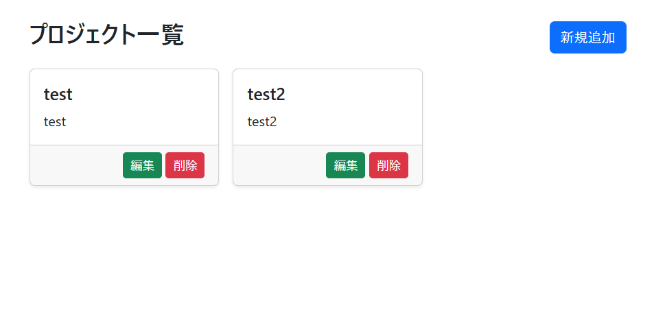
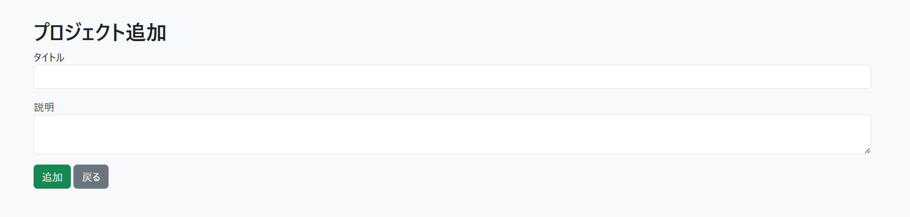
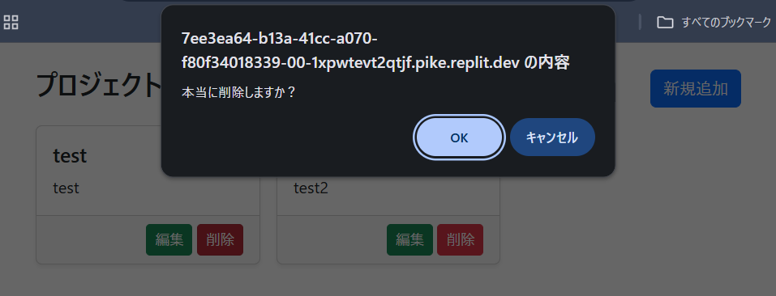

# Flask CRUD アプリ（ポートフォリオ）

## 概要
Python と Flask を用いて作成した Web ベースの CRUD アプリケーションです。  
ユーザーごとにデータを管理でき、データの登録・編集・削除を Web 上で行えます。  
削除操作時には確認ダイアログを表示して誤操作を防止しています。

## 工夫した点
- 削除操作時に確認ダイアログを表示し、誤操作を防止
- 入力値チェックを行い、不正なデータ登録を防ぐ設計
- 画面遷移と処理の流れが分かりやすい構成
- ユーザー認証機能を追加し、未ログイン状態ではポートフォリオ画面にアクセス不可

## 機能
- ログイン / ログアウト
- カード一覧表示
- 新規カード追加
- カード編集
- カード削除（削除確認ダイアログ付き）


※ 必要に応じて app.py 内でユーザーを追加してください。

---

## 今後の改善点
- 検索機能やページネーションの実装
- ユーザー登録機能の追加（現在は初期ユーザー固定）

---

## スクリーンショット
※ 実際のアプリ画面に置き換えてください

### トップページ（ログイン後）


### 新規追加ページ


### 編集ページ


### 削除確認ダイアログ


---

## 技術スタック
- Python 3.x
- Flask
- SQLAlchemy
- SQLite
- HTML / CSS
- JavaScript

---

## 実行方法（Windows）

1. リポジトリをコピーする
※ すでにフォルダがある場合はこの手順は不要です
```
git clone https://github.com/24ma04/flask-crud-portfolio.git
```
2. 作成されたフォルダに移動する
```
cd flask-crud-portfolio
```

3. 仮想環境の作成（推奨）
```
python -m venv venv
```
4. 仮想環境の有効化(成功すると、プロンプトの先頭に (venv) が表示されます)
```
venv\Scripts\activate
```
5. 依存ライブラリのインストール

# requirements.txt がある場合(推奨)
```
pip install -r requirements.txt
```
# なければ個別にインストール
```
pip install Flask Flask-Login Flask-SQLAlchemy Werkzeug
```
6. アプリ起動
```
python app.py
```
7. ブラウザでアクセス
```
http://127.0.0.1:5000/login
```
## 初期ユーザー
| ユーザー名 | パスワード |
|------------|------------|
| test       | 1234       |
